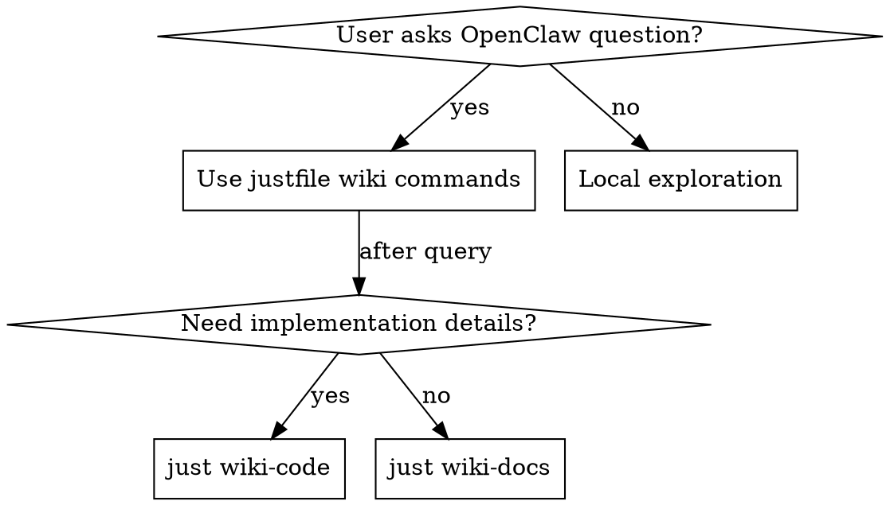

# Wiki Search - OpenClaw Knowledge Base

## Overview

The wiki is a **self-updating vector knowledge base** that indexes the entire OpenClaw codebase (docs, source code, skills, config schemas). It uses hybrid search (vector + keyword with RRF fusion) to find relevant information.

**CRITICAL:** Wiki commands use `just wiki-*`, **NOT the `openclaw` CLI**.

**Note for AI agents:** Use full `just` command (shell alias `j` won't work in Bash tool).

**Core principle:** For ANY OpenClaw-related question, query the wiki FIRST using justfile commands before exploring local files or making assumptions.

## When to Use



**✅ USE the wiki for:**
- Configuration questions (sandbox.mode values, telegram setup, tool policies)
- Implementation research (agent loop, tool execution, session lifecycle)
- Debugging (requireMention behavior, webhook issues, sandbox problems)
- Feature discovery (available channels, skill patterns, API capabilities)
- Schema validation (type definitions, allowed config values)

**❌ DON'T use for:**
- Questions about the USER's specific deployment state
- Current running service status (use `docker ps`, `just status` instead)
- Non-OpenClaw questions (general programming, other frameworks)

## Available Commands (Justfile ONLY)

**IMPORTANT:** All wiki commands use `just`, **NOT `openclaw` CLI**.

**For AI agents:** Always use full `just` command (user's shell alias `j` won't work in Bash tool).

| Command | When to Use | Example |
|---------|------------|---------|
| `just wiki-query "QUERY"` | General search (unclear scope) | `just wiki-query "agent loop"` |
| `just wiki-docs "QUERY"` | Config, setup, user-facing features | `just wiki-docs "sandbox modes"` |
| `just wiki-code "QUERY"` | Implementation, debugging, internals | `just wiki-code "tool execution"` |
| `just wiki-skills "QUERY"` | Skill development patterns | `just wiki-skills "external API"` |
| `just wiki-verify "QUERY"` | Docs unclear or behavior unexpected | `just wiki-verify "requireMention groups"` |
| `just wiki-stats` | Show KB statistics | `just wiki-stats` |
| `just wiki-latest` | Show current KB version | `just wiki-latest` |
| `just wiki-history` | Show last 10 releases | `just wiki-history` |
| `just wiki-since vX.Y.Z` | What changed since version | `just wiki-since v2026.2.9` |
| `just reindex` | Re-index the wiki database | `just reindex` |

**Query expansion is automatic:**
- `"tts"` → finds "text-to-speech", "voice", "speech"
- `"tg"` → finds "telegram"
- `"config"` ↔ `"configuration"` ↔ `"settings"`
- `"bot"` ↔ `"agent"` ↔ `"assistant"`

## Workflow

**Always follow this order:**

1. **Query wiki FIRST** using `just wiki-*` commands (appropriate mode)
2. **Review results** (check score, read snippets)
3. **Read full files if needed** (prepend `tools/wiki/source/` to paths)
4. **Provide answer with citations** (include file paths and line numbers)

**Example:**
```bash
# User asks: "How to configure sandbox.mode?"

# Step 1: Query wiki using justfile (NOT openclaw CLI!)
just wiki-docs "sandbox.mode configuration" --json

# Step 2: Review results
# → Result: { "path": "docs/gateway/sandboxing.md", "lines": "37-43", "score": 0.85 }

# Step 3: Read full file if needed
# Actual file location: tools/wiki/source/docs/gateway/sandboxing.md

# Step 4: Answer with citation
# "Configure sandbox.mode with three values: off, non-main, all (see docs/gateway/sandboxing.md:37-43)"
```

## Path Resolution

**CRITICAL:** Wiki results return paths **relative to the OpenClaw source repository**, not the wiki repo root.

**How to find actual files:**
```bash
# Wiki returns: "docs/channels/telegram.md"
# Actual location: tools/wiki/source/docs/channels/telegram.md

# Always prepend: tools/wiki/source/
```

**File path pattern:**
```
tools/wiki/source/${WIKI_RESULT_PATH}
```

## Result Interpretation

Each result contains:
```json
{
  "score": 0.85,              // Relevance (0-1, higher = better)
  "path": "docs/sandbox.md",  // Relative to source/
  "lines": "42-58",           // Line range
  "source": "docs",           // Content category
  "snippet": "...",           // Text excerpt
  "release": "v2026.2.12"     // OpenClaw version
}
```

**Filtering guidelines:**
- **score ≥ 0.7**: High relevance, likely correct
- **score 0.5-0.7**: Moderate relevance, review snippet
- **score < 0.5**: Low relevance, ignore or try different query

**Citation format:**
```
"Configure in channels.telegram.botToken (see docs/channels/telegram.md:42)"
```

## Common Mistakes

| Mistake | Why It's Wrong | Correct Approach |
|---------|---------------|------------------|
| **Using `openclaw wiki` command** | CLI doesn't have wiki search | Use `just wiki-query` instead |
| **Skipping wiki for "simple" questions** | Templates/examples may be outdated | Always query wiki first |
| **Reading local config files first** | User's deployment may be restructured | Query wiki, then suggest config |
| **Forgetting source/ prefix** | Paths are relative to OpenClaw repo | Prepend `tools/wiki/source/` |
| **Using general search for everything** | Slower, mixed results | Use specific modes (--docs, --code) |
| **Not citing sources** | User can't verify or explore further | Always include file:line citations |
| **Stopping at first template found** | Templates are examples, not docs | Continue to authoritative wiki docs |

## Red Flags - STOP and Use Justfile

These thoughts mean you're about to make a mistake:

- "I'll use `openclaw wiki`" → **NO!** Use `just wiki-docs` instead
- "Let me try `openclaw docs`" → **NO!** Use `just wiki-docs` instead
- "I'll use the `j` alias" → **NO!** Use full `just` command (alias won't work in Bash tool)
- "I'll just read the local config files" → Run `just wiki-docs` first
- "Let me check templates" → Run `just wiki-docs` first, templates second
- "This is a simple question, I don't need wiki" → Run `just wiki-docs` anyway
- "I'll explore the codebase directly" → Run `just wiki-code` for guidance first
- "I found an example, that's enough" → Verify with `just wiki-docs`

**All of these mean: Use `just wiki-*` commands FIRST, then supplement with local exploration.**

## Example Workflow

**Scenario:** User asks "How to configure Telegram requireMention for groups?"

```bash
# ❌ BAD: Try openclaw CLI
openclaw wiki "telegram requireMention"
# → Command not found! CLI doesn't have wiki search

# ❌ BAD: Try to use j alias
j wiki-docs "telegram requireMention groups"
# → Command not found! Alias doesn't work in Bash tool

# ❌ BAD: Skip wiki, read local files
Read /path/to/astromech/runtime/config/channels.json5
# → File doesn't exist or is outdated

# ✅ GOOD: Query wiki using full just command
just wiki-docs "telegram requireMention groups" --json

# Result:
# {
#   "score": 0.87,
#   "path": "docs/channels/telegram.md",
#   "lines": "156-165",
#   "snippet": "requireMention configuration for group chats..."
# }

# Read full file if needed:
# tools/wiki/source/docs/channels/telegram.md

# Provide answer with citation:
# "Set channels.telegram.groups.*.requireMention to false
#  (see docs/channels/telegram.md:156-165)"
```

## Verify Mode Usage

When docs are unclear or behavior is unexpected, use `just wiki-verify` to cross-reference docs with implementation:

```bash
# User reports: "requireMention doesn't work as documented in groups"

just wiki-verify "requireMention group behavior" --json

# Returns BOTH:
# - Documentation results (what SHOULD happen)
# - Code results (what ACTUALLY happens)

# Compare to identify discrepancies
```

## Quick Reference

**Decision Tree:**

| Question Type | Justfile Command | Example |
|--------------|------------------|---------|
| "How to configure X?" | `just wiki-docs` | `just wiki-docs "telegram bot token"` |
| "What values are valid for Y?" | `just wiki-docs` | `just wiki-docs "sandbox.mode values"` |
| "How does Z work internally?" | `just wiki-code` | `just wiki-code "agent loop execution"` |
| "Docs say X but Y happens" | `just wiki-verify` | `just wiki-verify "requireMention groups"` |
| "How to implement skill pattern?" | `just wiki-skills` | `just wiki-skills "external API call"` |
| "What changed in new release?" | `just wiki-since` | `just wiki-since v2026.2.9` |

## Real-World Impact

**Without this skill:** 50% miss rate on using wiki, wasted time reading non-existent local files, outdated template information, confusion trying `openclaw wiki` commands.

**With this skill:** Systematic justfile-based wiki search, authoritative documentation, accurate answers with citations.
