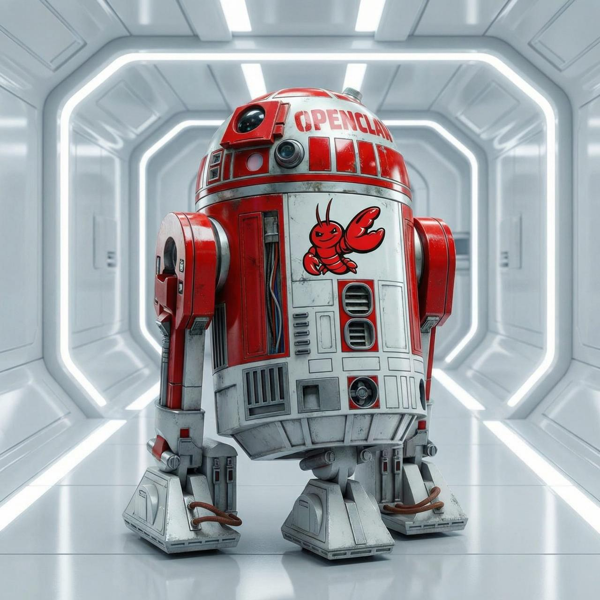
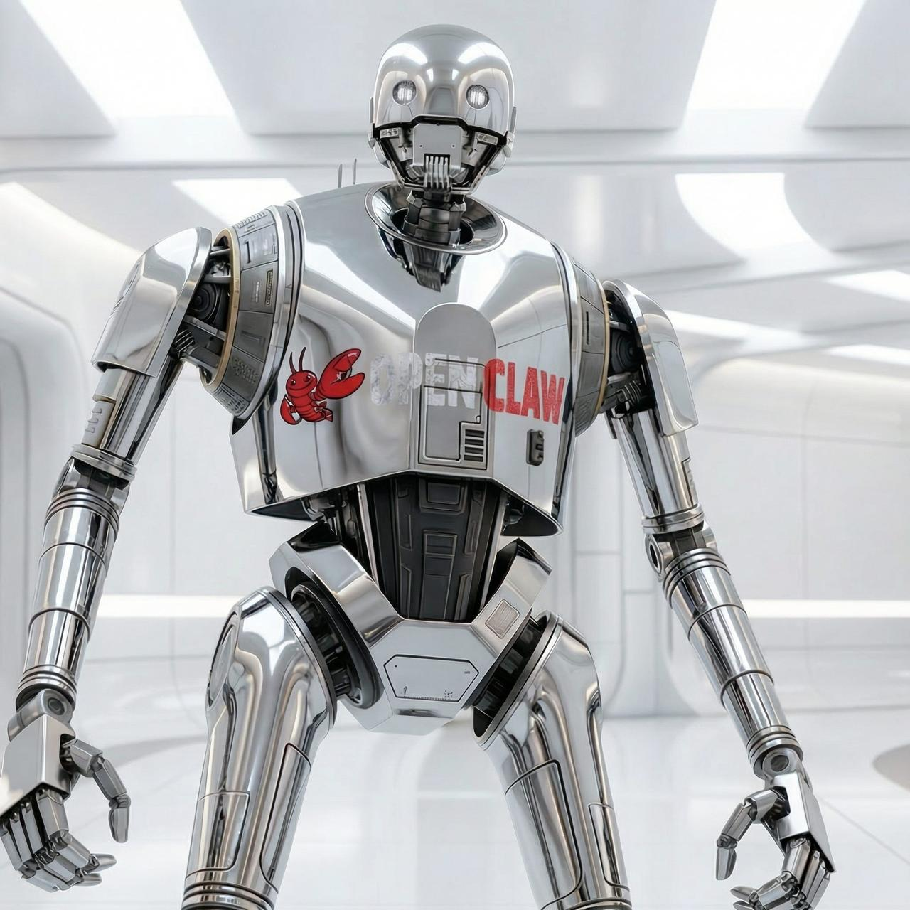
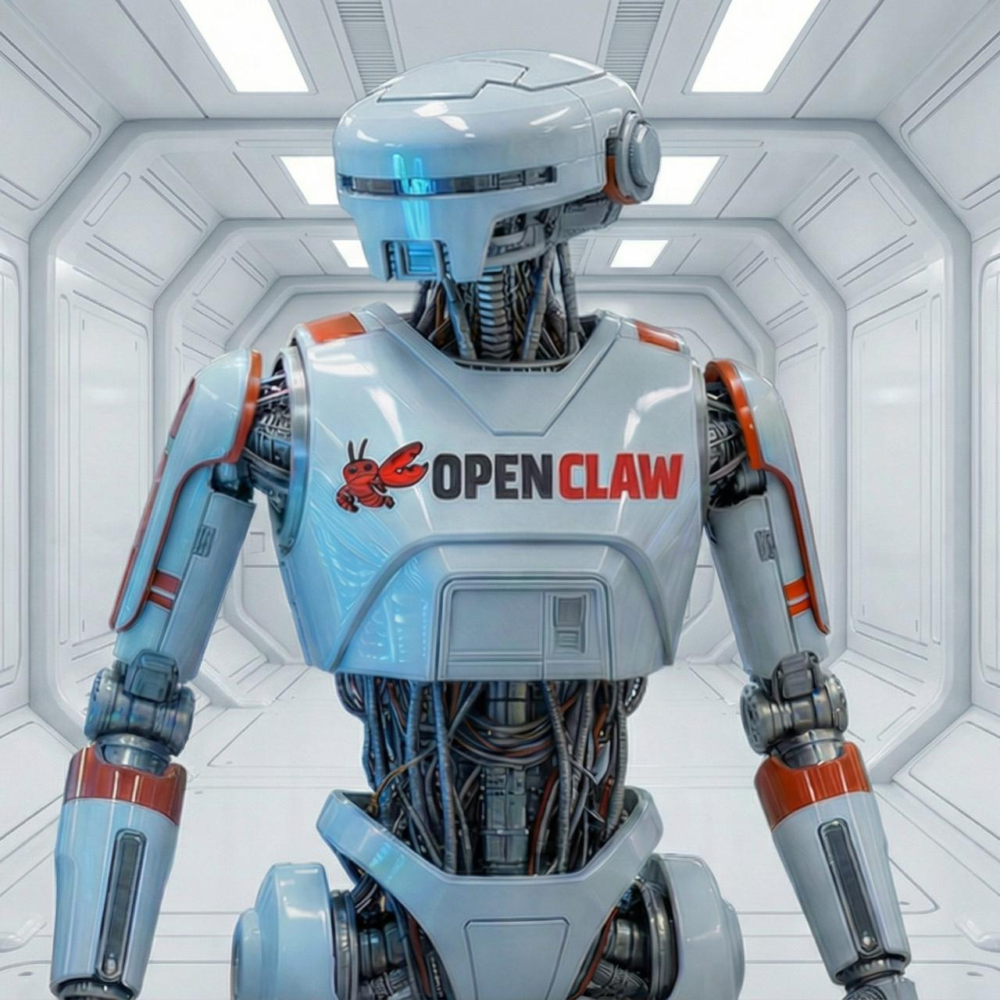
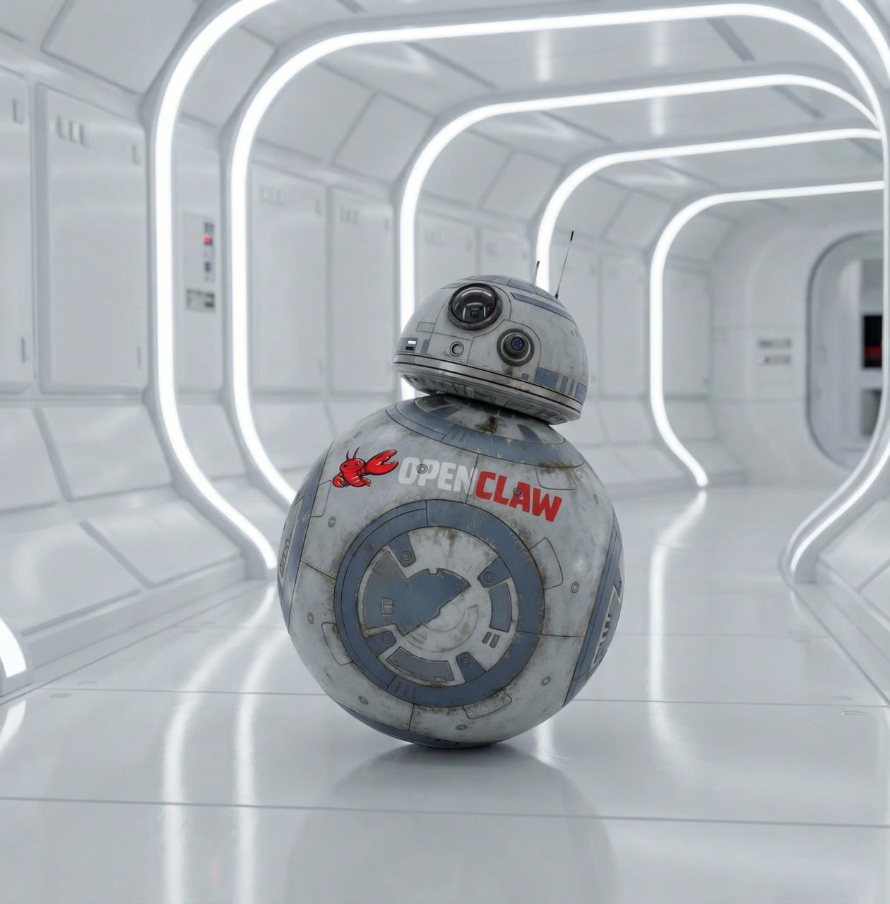
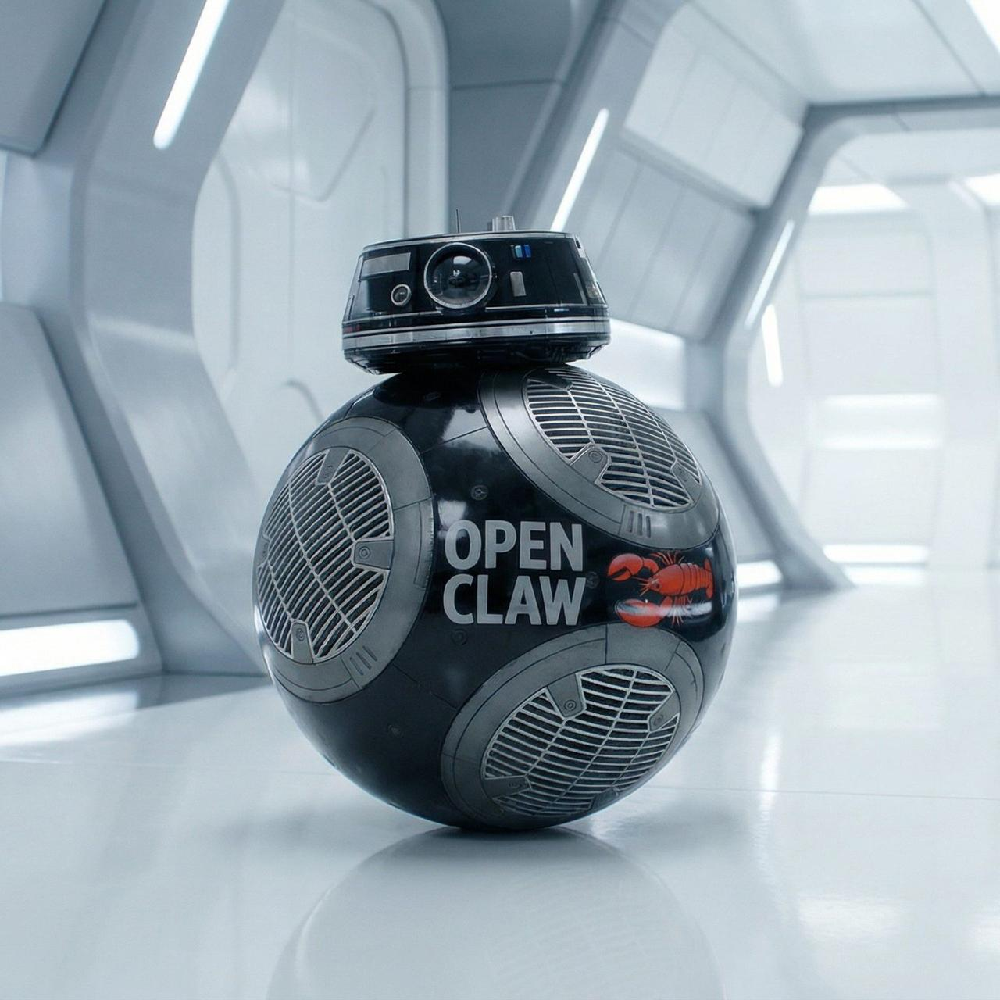
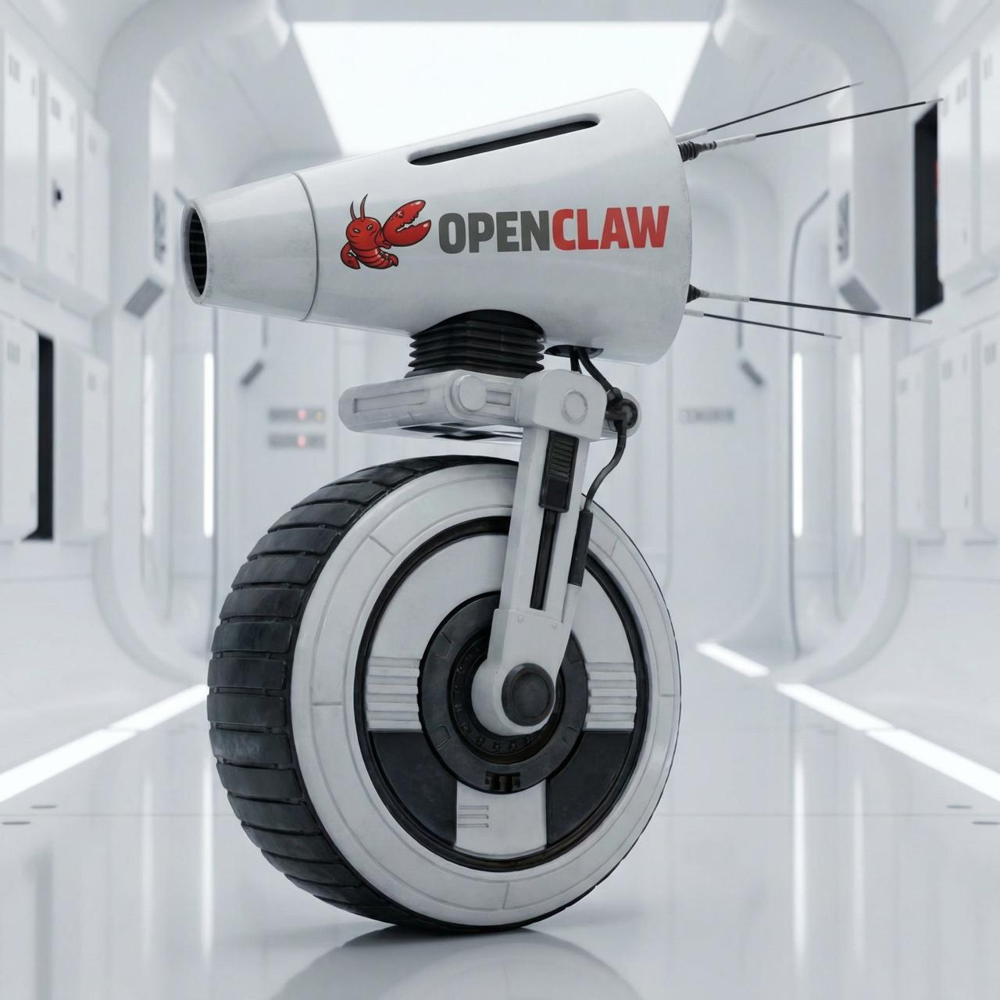
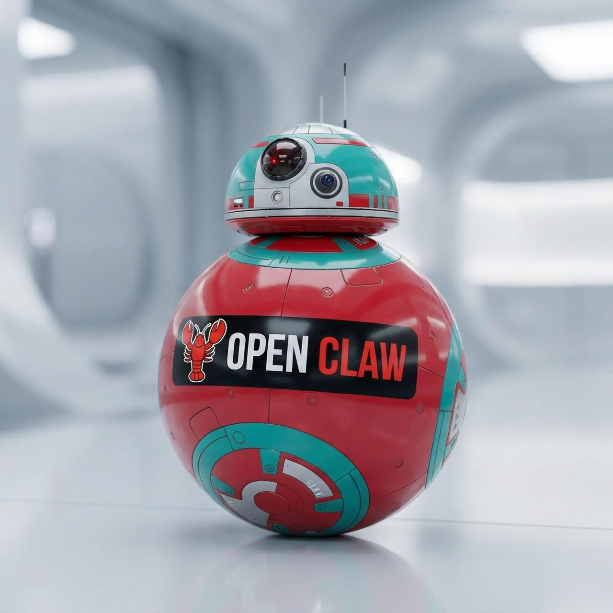
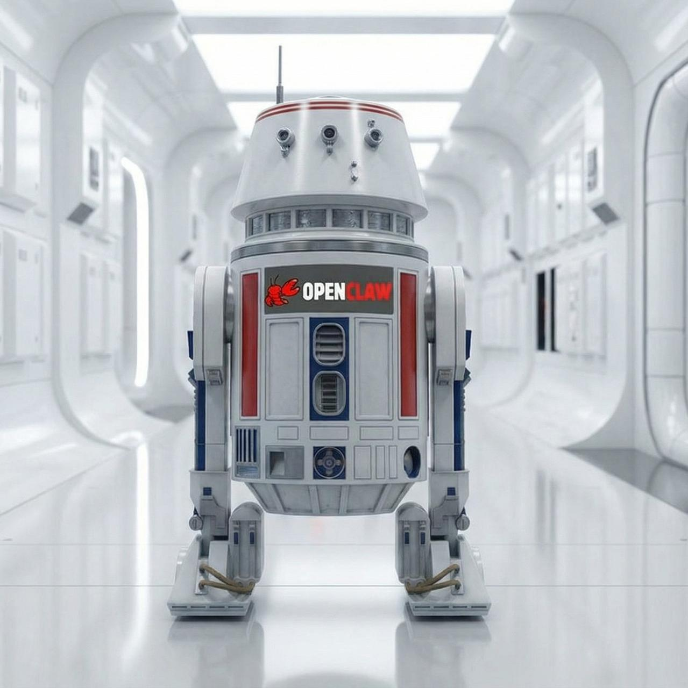

<div align="center">


# Astromech

**Your personal AI fleet. Tools you use yourself, now amplified by agents.**

*Powered by [OpenClaw](https://github.com/openclaw/openclaw)*

</div>

---

**English** · [Русский](README.ru.md)

---

*A long time ago in a galaxy far, far away....*

```
                        ╔═════════════════════════════════════════╗
                        ║      Episode II: THE FLEET EXPANDS      ║
                        ╚═════════════════════════════════════════╝

                   For too long, humans have fought alone — scattered
                  across a thousand decisions, carrying context no mind
                            was built to hold all at once.

                    A new order has emerged. Not of masters and servants,
                   but of pilots and droids. The human sets the direction.
                       The fleet handles the rest. One flies, many
                                     navigate.

                    Intelligence is no longer a solo act. The strongest
                   force in the galaxy is not a single Jedi — it is one
                           human, with the right droids beside them.

                              The fleet is online.
```

---

## Why droids. Why Star Wars.

Most people who build AI agents treat them like scripts — input, output, done. No name, no character, no continuity. You use them and forget them.

Star Wars did something different. R2-D2 is just circuits and memory. BB-8 is just a ball with a camera. But people *care* about them. They have favorites. They felt something when those droids were in danger. That's because each one had a consistent way of showing up — a personality you could recognize, trust, and rely on.

That's the design principle here. Each agent in this fleet has an identity, a character, a defined place in the hierarchy. Yoda doesn't just answer questions — he pushes back, holds the long view, stays calm when you're not. K-2SO doesn't just manage tasks — he tells you the probability your plan will fail. L3-37 doesn't just track habits — she notices when you're running yourself into the ground. The Star Wars names aren't decoration. They're a reminder that these agents are meant to have a *voice*, not just a function.

The other part of the philosophy: the human stays the pilot. Always. The fleet doesn't replace judgment — it amplifies it. Every specialist has a domain, a limited set of tools, and no access beyond what their role requires. One person moving faster, not one person replaced by automation.

This is a personal operating system. Built on tools already in use, now with the right droids beside them.

---

## Fleet Registry

| Unit | Role | Channels |
|------|------|----------|
| <br>**Yoda** | Fleet orchestrator — strategy, coordination & oversight | Telegram |
| <br>**R2-D2** | Infrastructure ops — servers, containers & deployments | Telegram |
| <br>**K-2SO** | Mission planner — tasks, projects & OKRs | Telegram |
| <br>**L3-37** | Health coach — fitness, wellness & habits | Telegram |
| <br>**C-3PO** | Knowledge librarian — writing, research & docs | Telegram |
| <br>**BB-8** | Marketing analyst — traffic, conversions & growth | Telegram |
| <br>**BB-9E** | HR analytics — staff tracking & performance | Telegram |
| <br>**R4-P17** | Finance analyst — P&L, cashflow & margins | Telegram |
| <br>**D-O** | SMM — social posts, scheduling & content | Telegram |
| <br>**CB-23** | Reserved — in the garage | — |
| <br>**R5-D4** | Reserved — in the garage | — |

---

## How it works

Messages arrive from Telegram. Yoda handles most conversations — strategy, decisions, coordination. Specialists take domain tasks: K-2SO creates Jira issues and plans sprints, L3-37 tracks health habits, R4-P17 pulls financial data. Each agent has access only to the tools relevant to its domain.

```
User (Telegram)
      │
      ▼
 Yoda (executive)
      │
      ├──▶ K-2SO ──▶ Jira · Todoist · OKR tools
      ├──▶ R2-D2 ──▶ Docker · servers · CLI
      ├──▶ L3-37 ──▶ health tracking
      ├──▶ C-3PO ──▶ knowledge base · writing
      ├──▶ BB-8  ──▶ marketing analytics
      ├──▶ BB-9E ──▶ HR data
      ├──▶ R4-P17──▶ finance
      └──▶ D-O   ──▶ Postiz · social platforms
```

Each agent can spawn sub-agents and workers for parallel execution. Depth capped at 2 to keep things sane.

---

## Memory

Each agent uses OpenClaw's native memory system — AI embeddings with a SQLite vector store. Sessions and daily notes are indexed and retrieved automatically, so the agent carries forward context from past conversations without manual intervention.

On top of that, a shared global layer is added via [OpenMemory](https://github.com/mem0ai/openmemory-mcp). Any agent can read or write to it. When a memory is saved, an OpenAI model processes it and assigns category tags from a fixed taxonomy: `personal` · `health` · `preferences` · `behavior-rules` · `work` · `technical` · `business` · `values`. On every new session, memories matching that agent's allowed categories are pulled and injected into its `USER.md` — so the agent starts each conversation already knowing what's relevant about the user.

Yoda has no category filter — it sees everything. Specialists see only what fits their domain.

---

## Voice

When an agent speaks, the response isn't just read aloud — it's shaped to sound like the character. Each agent's synthesized speech is processed through ffmpeg to match its persona, then merged with pre-recorded sounds from that character. The result lands as a single audio message that feels like the droid, not a generic text-to-speech voice.

The mood of the response determines which character sound plays as the intro. The agent picks the mood from context automatically.

| Mood | Used when |
|------|-----------|
| `default` | Normal responses |
| `happy` | Good news, completed tasks |
| `excited` | Celebrations, wins |
| `angry` | Errors, urgent warnings |
| `confused` | Clarifications, uncertainty |
| `worried` | Concerns, risks |

---

## Stack

Everything runs as a Docker Compose stack on a single VPS.

```
astromech/
├── .openclaw/              # Gateway runtime (mounted into container)
│   ├── openclaw.json       # Main config (imports from config/*.json5)
│   ├── config/             # Modular config: agents, channels, memory, hooks…
│   └── workspace-*/        # Per-agent: SOUL.md, IDENTITY.md, skills, memory
├── compose/                # Docker Compose service files (one per service)
├── dockerfiles/            # Custom image definitions
├── data/                   # Persistent bind-mount data
├── tools/
│   └── wiki/               # OpenClaw knowledge base (vector DB, 10k+ chunks)
└── justfile                # Task runner
```

The gateway runs a custom Docker image extending upstream OpenClaw with: `jira-cli`, `todoist`, `jq`, `ripgrep`, `just`, Alice adapter, SpeechKit TTS sidecar.

---

## Admin

```bash
just recreate          # Recreate containers (picks up config/volume changes)
just wiki-docs "..."   # Query OpenClaw documentation
just wiki-code "..."   # Search OpenClaw source code
```
